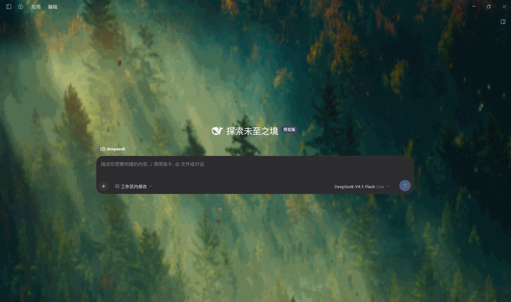
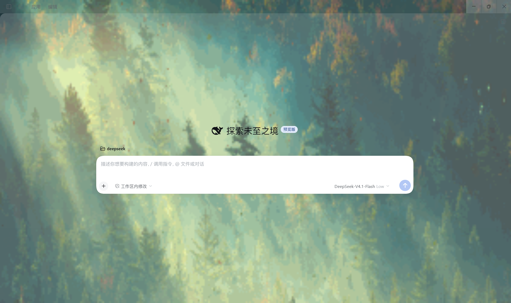
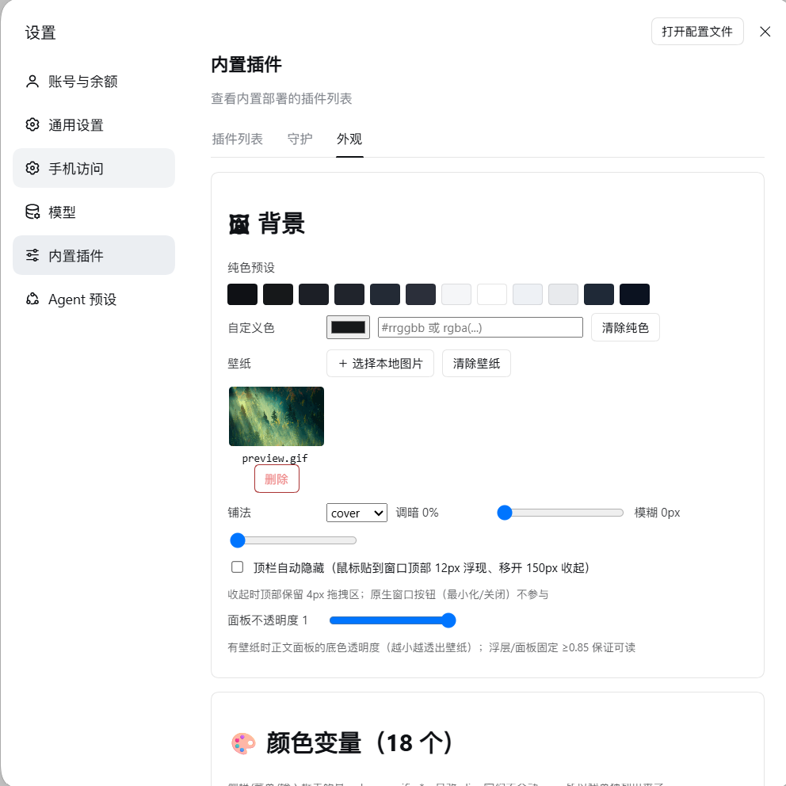
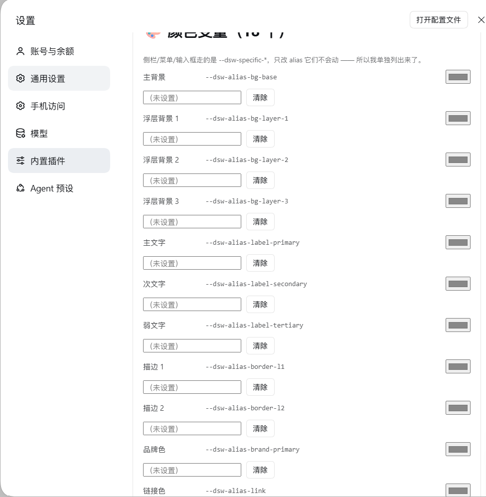

# dsh-appearance｜DSH 官方桌面端外观编辑器

给 DeepSeek Harness 官方桌面端换背景、调配色，做自己的界面风格。

| 深色效果 | 浅色效果 |
|:---:|:---:|
|  |  |

安装插件后，在「设置 → 内置插件 → 外观」中选择本地壁纸、调整 18 个颜色变量，或添加受限的自定义规则；需要时可以恢复默认。它不修改 DSH 核心。

**适合你，如果：**你想给桌面端换壁纸、调整界面配色，或微调特定控件的外观。

## 能做什么

| 能力 | 说明 |
|---|---|
| 背景 | 12 个纯色预设或自定义颜色；可选择本地壁纸并调整铺法、暗度、模糊与面板透明度 |
| 配色 | 调整 18 个颜色变量，覆盖侧栏、菜单、输入框和气泡等位置 |
| 自定义规则 | 读取当前页面类名后，从属性白名单中添加规则，最多 200 条 |
| 恢复默认 | 清除自定义效果，回到默认外观 |

<details>
<summary>查看编辑器截图：背景设置与颜色变量</summary>



截图中可见的“顶栏自动隐藏”开关目前效果不可靠，暂不作为已支持功能。



</details>

## 安装

通过 DSH 插件命令安装：

```powershell
dsh plugin --profile desktop add dsh-appearance-editor
```

安装后打开「设置 → 内置插件 → 外观」。若面板尚未出现，重启 DSH 官方桌面端。卸载和本地源码安装见下文。

## 兼容与限制

- 面向 Windows 上的 DSH 官方桌面端；需要 Node.js 20 或更新版本。
- 不提供无边框标题栏、托盘菜单或应用级 `Ctrl+Alt+U` 热键。顶栏自动隐藏虽有设置开关，但当前效果不可靠，暂不作为可用能力。
- 自定义规则依赖当前页面类名；DSH 更新后，类名变化时可能需要重新选择目标。

## 开发与排错

这个插件把原先自制外壳（`DSH-Desktop\shell-app\`）中的外观编辑器迁移到 DSH 官方桌面端。原版依赖 Electron 主进程的 `webContents.insertCSS`、IPC 和自绘标题栏，不能直接复制；本插件改用服务端存储配置并生成 CSS，客户端将 CSS 加入 `<style>`，同时提供设置面板。

**源码仓库：**<https://github.com/stars-3/dsh-appearance> · **npm 包：**`dsh-appearance-editor`

**本地源码**（开发用）：

```powershell
powershell -ExecutionPolicy Bypass -File Install-Plugin.ps1 -Profile desktop
# 或者双击 Install-Plugin.cmd（默认装到 desktop）
```

> ⚠️ **改包名要同时改两处，否则「服务端全绿、界面全坏」**（账本 **E80**，2026-09-26 真机踩过）：
> ① `cordis.patch.yml` 的 `insert.name` **必须等于包名** —— DSH 只把 bundle 包**按包名**链接进
> 模块回退目录（写成旧名 → `/dsh-appearance/*` 全 404、面板不挂载）；
> ② `client/client.js` 里 `window.__ModuleLoader__.load({ id })` **也必须等于包名** ——
> 官方端按包名注册进客户端图，加载后**断言**该 id 注册过，不一致就抛
> `loaded without registering "<pkg>" via __ModuleLoader__.load`（面板不挂载、CSS 注入失效）。
> 版本：**0.1.0 两处都错 → 0.1.1 修 ① → 0.1.2 修 ②**（现用 0.1.2）。
> 自查：`DSH-Desktop\tools\Check-PluginPackaging.ps1 -Dir <本目录>`、
> 运行时：`DSH-Desktop\tools\probe-client-bundle-ids.mjs`。
> 本地源码装（`Install-Plugin.ps1`）走另一套：拷进 `node_modules\dsh-appearance`，旧名仍可用。

装完的**生效方式（两种情形别混，2026-09-26 实测）**：**新增 bundle 会热加载**（装完约 18 秒服务端路由
即可访问）；但**改本插件内部代码后必须重启官方端** —— 服务端插件模块在进程内有缓存，
触碰 profile 也不会重新 `import`（判别法：看返回文案变没变）。**客户端那半**
（面板 / 样式）刷新页面（`Ctrl+R`）即可。之后：设置 → 插件 → **外观**。

卸载：`Install-Plugin.ps1 -Revert -Profile desktop`

## 它怎么工作（单一事实来源）

```
lib/appearance-core.js   纯逻辑：默认值 / 校验白名单 / buildCss（**逐字移植自 shell-app\main.js**）
        ↑                        ↑
lib/index.js（服务端）      client/client.js（客户端）
 · $DSH_HOME\appearance\     · 拉 GET /dsh-appearance/style.css 贴进 <style>
   ├ appearance.json         · 设置页「外观」面板（改完 POST /state 再刷新样式）
   └ wallpaper\
 · 路由：/state /reset /wallpaper /style.css
```

**CSS 只由服务端生成** —— 客户端不拼 CSS、不复制白名单，避免"两处逻辑漂移"（账本 §5.1）。

状态目录默认 `%USERPROFILE%\.dsh\appearance\`，可用 `DSH_APPEARANCE_DIR` 覆盖（自检用）。

## 自检（可复现）

```powershell
node tools\test-appearance-core.mjs     # 纯逻辑：默认值/白名单/夹取/CSS 生成（含阳性+阴性对照）
node tools\test-host-load.mjs           # 服务端：路由注册、读写落盘、壁纸上传/取回、CSS 内容
node tools\test-client-load.mjs         # 客户端：bundle 形状、服务名 vs 包名、Tab 注册、渲染
```
